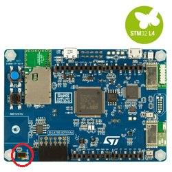
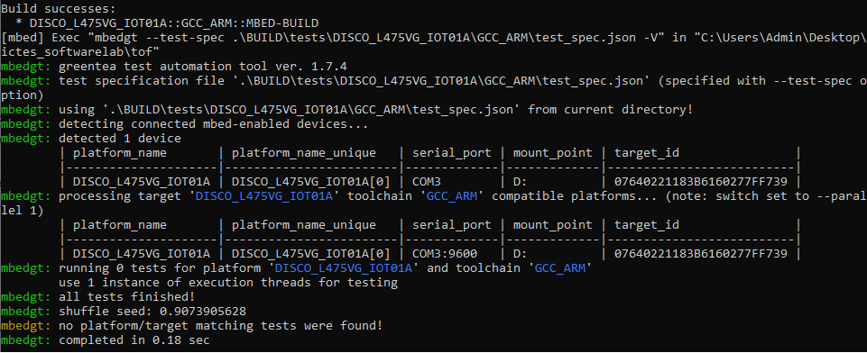

# Car-parking Group work assignment for Hardware part
This section is to explain the system in hardware part of Car-parking group [ToF folder](https://github.com/ICT710-TAIST-12-Group1/software_Taist/tree/master/ToF)

we use  
  
- Time-of-Flight and gesture-detection sensor (VL53L0X) of DISCO_L475VG_IOT01A board in hardware part (as red circle)
- [VL53L0X](https://os.mbed.com/teams/ST/code/VL53L0X/#e9269ff624ed) library 
- According to the standard size of car-park-lot the high is 2.4 meter and normal car height is around 1.47 meter referd by this site 

 
- we decided to use the ToF (mm) threshold
```
 if more than 1000 == no car in the lot
```
- in order to test the system 
    - for read data testing  
        **Test case**: VL53L0X module  
        **Discription**: Verify that VL53L0X module is work properly  
        **Test procedure**:  
        1.	activate the sensor.  
        2.	change the distance.
        3.	check the value from sensor.  
	
        **Test data/device**: the values from sensor.  
        **Expected results**: the value from sensor will be changed, when the distance change.  
        **Actual results**: Sensor can not return the value when object is out of range(around 2 meter).

    - for the threshold value testing   
        **Test case**: Threshold value  
        **Description**: Determine accurate threshold value to define that a parking lot is empty or occupied.  
        **Test procedure**:   
        1.	Set-up the board to get data properly.    
        2.	Examine accuracy of the data from the sensor by set-up actual environmental situation of the parking with car and without car.     
            - set board on the top of the ceiling, facing the sensor down to the floor.     
            - get data from the sensor in both situations, with car and without car.  
        3. Compare the data difference between with car and without a car.   
        4. you will get the threshold value.  

        **Test data/device**: The values from time of flight sensor.    
        **Expected results**: Knowing the car parking lot is empty or occupied.   
        **Actual results**: The sensor is too weak to sense the time of flight that more than around 1.5 meters. Hence, we may not sure that if the data lost coming from "Empty" or "sensor is wrong".    

    - for the publication of mqtt  
	**Test case**: Mqtt  
        **Discription**: To send message through mqtt.  
        **Test procedure**:  
        1.	Read data from sensor.  
        2.	Publish by mqtt.  
        3.	Use MQTTBox to subscibe.  
        4.	Check message.  
        
        **Test data/device**: The values from sensor.  
        **Expected results**: Recieve a correct message in MQTTBox.  
        **Actual results**: Sensor can read the data but it cannot publish to MQTTBox.  


    - we use [mbed](https://os.mbed.com/docs/mbed-os/v5.15/tools/test-and-debug.html) as testing system and debugging tools [black box]
    ```
     mbed test -t GCC_ARM -m auto -v --source . --source ../mbed-os --source VL53L0X
    ```
    - the result will show like this [it will take some time] 


# Members
- Asadang Tanatipuk     6222040484  
- Pitisit Dillon        6222040278  
- Thanakorn Aksorndit   6222040336  